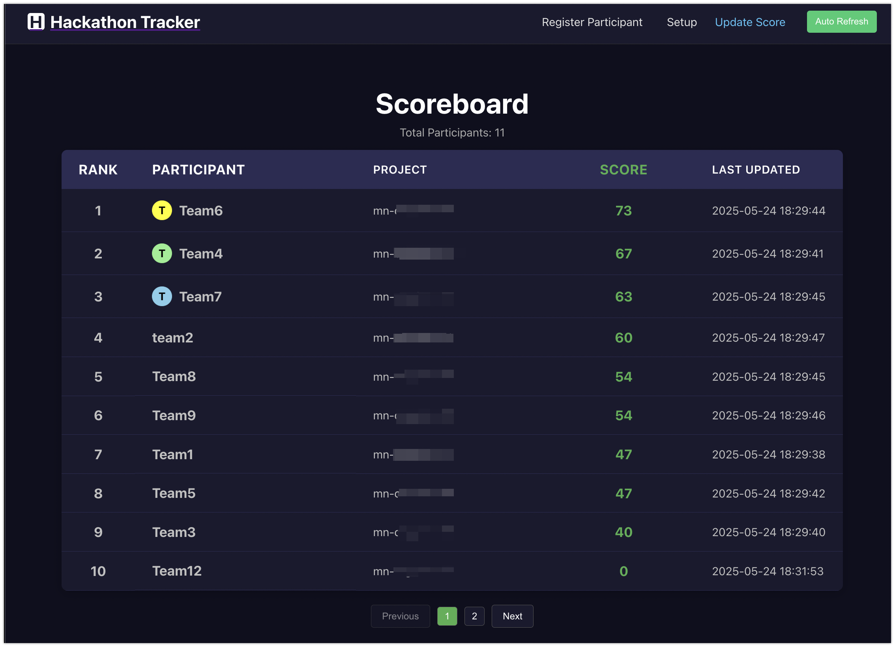

# Hackathon Scoreboard to Google Cloud Run


This document outlines the steps to deploy the frontend and backend services of the Scoreboard application to Google Cloud Run.

  


## Backend Deployment

The backend is a Python Flask application.

### Deploy to Cloud Run

Navigate to the `backend` directory:
```bash
cd backend
```

Deploy the image to Cloud Run. Replace `scoreboard-backend-service` with your desired Cloud Run service name and adjust the region as needed.

```bash
gcloud run deploy scoreboard-backend-service \
    --source . \
    --platform managed \
    --region us-central1 \
    --allow-unauthenticated \
    --min-instances 1 \
    --timeout 300 \
    --execution-environment gen2
    # Add any other necessary flags as mentioned above.
```
Note down the URL provided after successful deployment. This will be your backend API endpoint.

## Frontend Deployment


### 1. Configure Backend URL

Update BACKEND_URL in the src/App.js` with Backeend Cloud Run URL

1.  **Navigate to the frontend directory**:

```bash
cd frontend/script 
```

Update deploy.sh with your PROJECT_ID

```bash
./deploy.sh
```

This `README.md` provides a comprehensive guide for deploying both the frontend and backend to Cloud Run.
